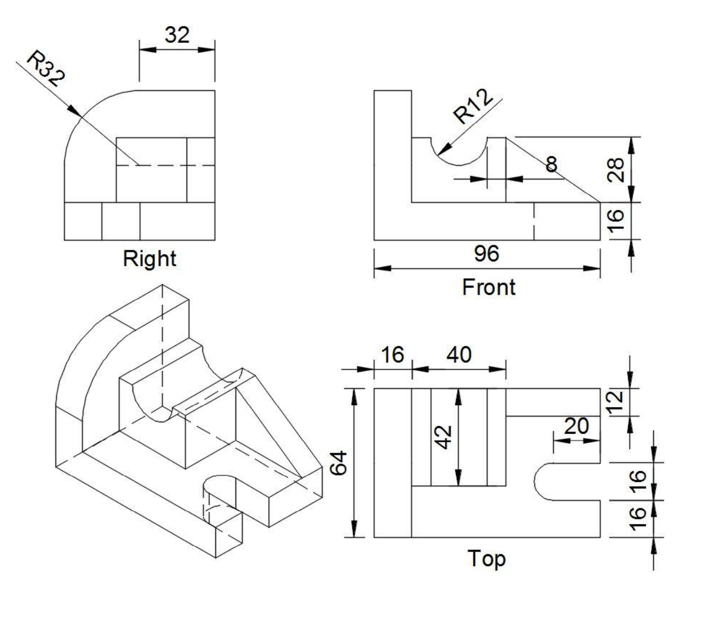

# Making a Wonky Part with a Cut and a Groove

### The Spec

### [The Onshape Link](https://cad.onshape.com/documents/e72e91ec21594e2fdf7d7b24/w/1368c2f9a34f6fb30c86b039/e/611f5060c52d8a52c514061c)

### A GIF in action

