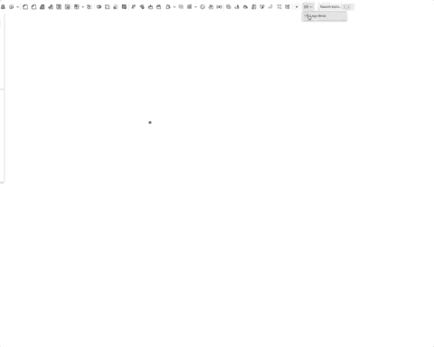
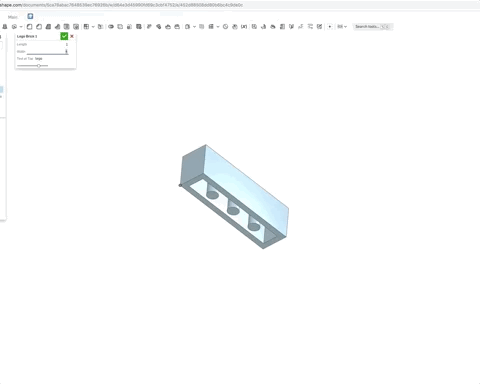

# Making a Lego Brick Part

It varies its shape based off its dimensions!

### The Spec

### [The Onshape Link](https://cad.onshape.com/documents/5ca78abac7648539ec76926b/w/d64e3d45990fd69c3cbf4752/e/b9ff7ee205406700792d9ed6)

### A couple of GIFs in action

