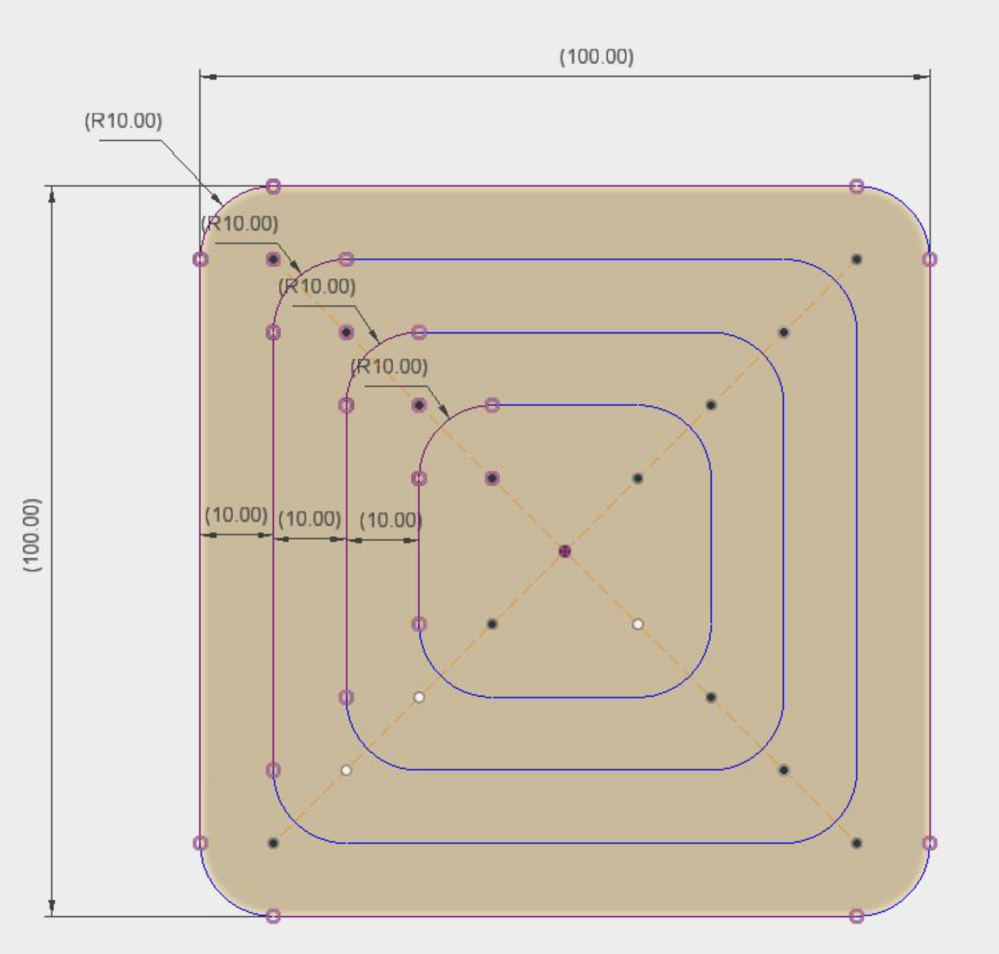
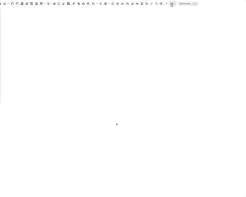

# Making a Square Sketch

### The Spec

### [The Onshape Link](https://cad.onshape.com/documents/84b1dd9ee707e97fb321d40e/w/e01abc1a6a22ff97190a9158/e/75457cdc86cce7ca44e7586f)

### A GIF in action

